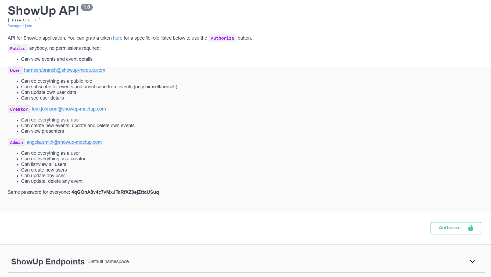

# Udacity Fullstack Nanodegree capstone project: ShowUp-Meetup


Demo link to the application hosted on Heroku: [ShowUp](https://showup-meetup.herokuapp.com/)

This project is a workspace for practicing and showcasing different set of skills related to the web development. It includes data modelling, API design, authentication, authorization and cloud deployment.

This is only a backend that provides API interface.

This project simulates some meetup.com API functionalities, like:
- You can list events, based on:
    - Location data: city, country
    - Event time
    - Custom search keyword
    - Format: online, in-person, hybrid
- You can subscribe/unsubscribe for events
- You can create and modify events:
    - Event name
    - Event location: city & country
    - Event picture
    - Event topics, like "technology", "music", etc.
    - Event time
    - Event format, as online, in-person, hybrid
    - Define users who can act as presenter
- You can modify own profile data:
    - Name
    - Email
    - Location data
    - Picture
- You can mark your profile as is_presenter:
    - to show for other event organizers that you are capable of running the show :)

## Roles and Permissions

There are three predefined roles in the application: admin, creator and user.

**Public** anybody, no permissions required:
- Can view events and event details only

**User** additional permissions: `get:users-details`, `update:users`, `create:users-events-rel`, `delete:users-events-rel`
- Can do everything as a public role
- Can subscribe for events and unsubscribe from events (only himself/herself)
- Can update own user data
- Can see user details

**Creator** additional permissions: `create:events`, `update:events`, `delete:events`, `get:presenters`
- Can do everything as a user
- Can create new events, update and delete own events
- Can view presenters

**Admin** additional permissions: `override:all`, `create:users`, `get:users`
- Can do everything as a user
- Can do everything as a creator
- Can list/view all users
- Can create new users
- Can update any user
- Can update, delete any event

Example users can be used with this password: _4qGOnA8v4c7vMxJTaRfXZ0ejZttaUSuq_
- **user:** harrison.branch@showup-meetup.com
- **creator:** tom.johnson@showup-meetup.com
- **admin:** angela.smith@showup-meetup.com

Example tokens generated in the `test_token.json` file.

## Working Locally
All backend code follows [PEP8 style guidelines](https://www.python.org/dev/peps/pep-0008/).

### Installing Python3 and Dependencies

The backend uses [Python v3.10](https://docs.python.org/3/using/unix.html#getting-and-installing-the-latest-version-of-python)
All required packages are included in the requirements file. From the `backend` folder run `pip3 install -r requirements.txt`.

- Key Dependencies:
  - [Flask](https://flask.palletsprojects.com)
  - [Flask-CORS](https://flask-cors.readthedocs.io/en/latest/#)
  - [Flask-RestX](https://flask-restx.readthedocs.io/en/latest/)
  - [Flask-Testing](https://pythonhosted.org/Flask-Testing/)
  - [Requests](https://docs.python-requests.org/en/latest/)
  - [Jose](https://pypi.org/project/python-jose/)
  - [Flask-Migrate](https://flask-migrate.readthedocs.io/en/latest/)

Environment variables can be found in the `.env` file.

### Database setup
1. The backend based on the [PostgreSQL](https://www.postgresql.org) DBMS. You need to set up a database with the following command: `createdb showup`. You may want to change the database name and path in the `.env` file. 
2. After setting up the database run `flask db upgrade` command. It will create all the database tables and populate them with some seed data. 

### Auth0 Account
The application uses [Auth0](https://auth0.com) for authentication and session management. If you want to use your own service then you need to update the related information in the `.env` file and create permissions described in the [#Roles and Permissions] chapter.

### Running the Server
Start the backend application with the following commands from the root folder: 
 ```shell
export FLASK_APP=app
export FLASK_ENV=development
flask run
```
The application is run on http://127.0.0.1:5000/ by default and is a proxy in the frontend configuration.

## Tests
1. In order to run tests you need to create a separate database. You can use the following command to create one: `createdb showup`. Change the database name and path in the `test_app.py` file.
2. After that you can use the following command to the test cases: `python3 -m unittest -v`
3. Also, you can test the application endpoint with Postman collection: `showup.postman_collection.json`

All tests are kept in that `test_app.py` and should be maintained as updates are made to app functionality.

## API reference
This version of the application **requires authentication**.

Detailed and interactive documentation of the endpoints can be found on the demo website: https://showup-meetup.herokuapp.com/.
